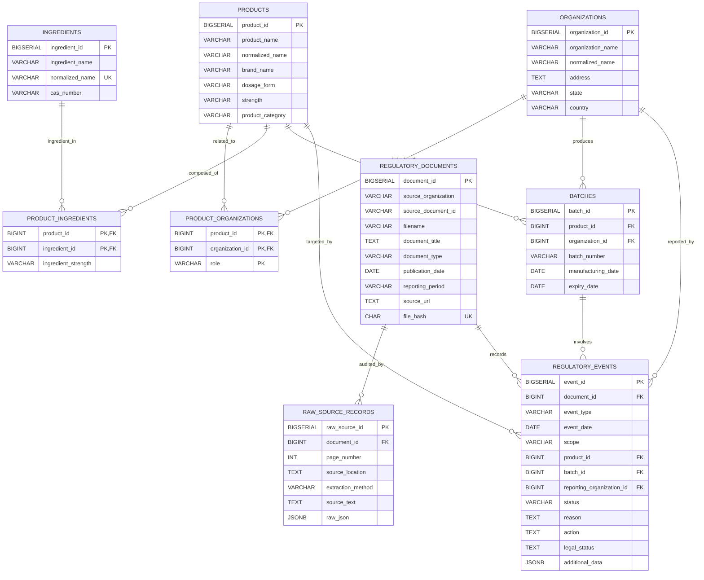

# V1 Relational Database Schema Design (Absolute Final DDL — Frozen Version)

**Medicine Scanner Pipeline — Regulatory & Quality Extractions**

---

## 🏛️ Architecture Overview

The V1 database schema decouples document extraction lineage, entity normalization (products, batches, organizations, ingredients), and core regulatory event tracking.

### Core Design Principles:

1. **`organizations` Table**: Unified entity table handling Manufacturers, Importers, State FDAs, Testing Laboratories, and Applicants.
2. **`product_organizations` Junction Table**: Solves the *"Approved Drug without Batch"* problem by linking products directly to organizations with explicit roles (`MANUFACTURER`, `IMPORTER`, `APPLICANT`, `MARKETING_AUTHORIZATION_HOLDER`).
3. **`regulatory_documents` & `regulatory_events`**: Normalized core regulatory actions and header PDF metadata.
4. **`additional_data JSONB`**: Stores document-specific contextual attributes (indications, adverse reactions, remarks, gazette notification details) to maintain zero NULL-column waste in SQL tables.
5. **`raw_source_records`**: Maintains 100% audit lineage back to raw extracted text and JSON page locations.

---

## 📊 ERD Table Relationship Diagram



---

## 🛠️ Complete SQL DDL Schema Specification

```sql
-- =========================================================
-- 1. ORGANIZATIONS
-- Handles Manufacturers, Importers, Labs, State FDAs
-- =========================================================
CREATE TABLE organizations (
    organization_id BIGSERIAL PRIMARY KEY,
    organization_name VARCHAR(500) NOT NULL,
    normalized_name VARCHAR(500),
    address TEXT,
    state VARCHAR(100),
    country VARCHAR(100) DEFAULT 'India',
    created_at TIMESTAMPTZ DEFAULT CURRENT_TIMESTAMP
);

-- =========================================================
-- 2. INGREDIENTS (APIs)
-- =========================================================
CREATE TABLE ingredients (
    ingredient_id BIGSERIAL PRIMARY KEY,
    ingredient_name VARCHAR(500) NOT NULL,
    normalized_name VARCHAR(500) UNIQUE,
    cas_number VARCHAR(100)
);

-- =========================================================
-- 3. PRODUCTS (Master Catalog)
-- =========================================================
CREATE TABLE products (
    product_id BIGSERIAL PRIMARY KEY,
    product_name VARCHAR(500) NOT NULL,
    normalized_name VARCHAR(500),
    brand_name VARCHAR(500),
    dosage_form VARCHAR(200),
    strength VARCHAR(200),
    product_category VARCHAR(50) NOT NULL 
    -- DRUG / MEDICAL_DEVICE / IVD_KIT / VACCINE / FDC / COSMETIC
);

-- =========================================================
-- 4. PRODUCT ↔ INGREDIENT (For FDCs & Multi-ingredient)
-- =========================================================
CREATE TABLE product_ingredients (
    product_id BIGINT REFERENCES products(product_id) ON DELETE CASCADE,
    ingredient_id BIGINT REFERENCES ingredients(ingredient_id) ON DELETE CASCADE,
    ingredient_strength VARCHAR(200),
    PRIMARY KEY (product_id, ingredient_id)
);

-- =========================================================
-- 5. PRODUCT ↔ ORGANIZATION (Product-Level Relations)
-- Solves the "Approved Drug without Batch" problem
-- =========================================================
CREATE TABLE product_organizations (
    product_id BIGINT REFERENCES products(product_id) ON DELETE CASCADE,
    organization_id BIGINT REFERENCES organizations(organization_id) ON DELETE CASCADE,
    role VARCHAR(50) NOT NULL,
    -- MANUFACTURER / IMPORTER / APPLICANT / MARKETING_AUTHORIZATION_HOLDER
    PRIMARY KEY (product_id, organization_id, role)
);

-- =========================================================
-- 6. REGULATORY DOCUMENTS (Header PDF Metadata)
-- =========================================================
CREATE TABLE regulatory_documents (
    document_id BIGSERIAL PRIMARY KEY,
    source_organization VARCHAR(200) NOT NULL, -- CDSCO, PvPI, State FDA
    source_document_id VARCHAR(200),           -- Stable ID from source if available
  
    filename VARCHAR(500) NOT NULL,
    document_title TEXT,
    document_type VARCHAR(100),                -- BANNED_LIST, NSQ_ALERT, ADR_ALERT
    publication_date DATE,
    reporting_period VARCHAR(100),
  
    source_url TEXT NOT NULL,
    file_hash CHAR(64) UNIQUE,                 -- Fallback dedup if source_document_id is NULL
    created_at TIMESTAMPTZ DEFAULT CURRENT_TIMESTAMP,
  
    -- Unique when source provides a stable document ID
    UNIQUE (source_organization, source_document_id)
);

-- =========================================================
-- 7. RAW SOURCE RECORDS (Audit Trail)
-- =========================================================
CREATE TABLE raw_source_records (
    raw_source_id BIGSERIAL PRIMARY KEY,
    document_id BIGINT NOT NULL REFERENCES regulatory_documents(document_id) ON DELETE CASCADE,
    page_number INT,
    source_location TEXT,
    extraction_method VARCHAR(50), -- TEXT / OCR / MIXED
    source_text TEXT,
    raw_json JSONB,
    extraction_timestamp TIMESTAMPTZ DEFAULT CURRENT_TIMESTAMP
);

-- =========================================================
-- 8. BATCHES (Identity Only)
-- =========================================================
CREATE TABLE batches (
    batch_id BIGSERIAL PRIMARY KEY,
  
    product_id BIGINT REFERENCES products(product_id),
    organization_id BIGINT REFERENCES organizations(organization_id),
  
    batch_number VARCHAR(200) NOT NULL,
    manufacturing_date DATE,
    expiry_date DATE,
  
    -- Prevent duplicate batch entries for the same product and manufacturer
    UNIQUE (product_id, organization_id, batch_number)
);

-- =========================================================
-- 9. REGULATORY EVENTS (Core Action Table)
-- =========================================================
CREATE TABLE regulatory_events (
    event_id BIGSERIAL PRIMARY KEY,
    document_id BIGINT NOT NULL REFERENCES regulatory_documents(document_id),
  
    event_type VARCHAR(100) NOT NULL, -- QUALITY_ALERT, PROHIBITION, ADR, RECALL, APPROVAL
    event_date DATE,
  
    scope VARCHAR(50) NOT NULL, 
    -- BATCH / PRODUCT / INGREDIENT / COMBINATION / DOCUMENT
  
    -- Relationships (Nullable based on scope)
    product_id BIGINT REFERENCES products(product_id),
    batch_id BIGINT REFERENCES batches(batch_id),
    reporting_organization_id BIGINT REFERENCES organizations(organization_id),
  
    -- Status & Outcomes
    status VARCHAR(100), -- NSQ, SPURIOUS, PROHIBITED, APPROVED, UNDER_INVESTIGATION
    reason TEXT,
    action TEXT,
    legal_status TEXT,
  
    -- Document-Specific Attributes
    additional_data JSONB 
);
```

---

## 🏗️ Architecture Flow (Final)

```
PDF
 ↓
regulatory_documents (File metadata)
 ↓
raw_source_records (Audit trail & raw text)
 ↓
PDF Classification
 ↓
Normalization
 ↓
regulatory_events (Core action)
 ├── product_id (via product_organizations for master data)
 ├── batch_id (via batches for lot-specific data)
 ├── reporting_organization_id (Who reported it?)
 └── additional_data JSONB (Contextual fields)
```

---

## 💡 ETL Implementation Strategy (Python + SQL)

When building the database ingestion pipeline, execute the **Upsert & Map Strategy**:

1. **Extract**: Parse JSON output files from accepted folders in `08_json_conversion/output/` (`alerts/`, `banned_drugs/`, `fdc/`, `ipc_pvpi/`, `nsq_json/`).
2. **Load Organizations**: Extract unique company/lab/importer entities $\rightarrow$ `INSERT INTO organizations ... ON CONFLICT (normalized_name) DO NOTHING`. Retrieve `organization_id`s.
3. **Load Products**: Extract unique product/drug names $\rightarrow$ `INSERT INTO products ... ON CONFLICT (normalized_name) DO NOTHING`. Retrieve `product_id`s.
4. **Map Product ↔ Organization**: For product-level approvals or brand relationships, insert into `product_organizations (product_id, organization_id, role)`.
5. **Load Batches (if applicable)**: For lot-specific quality failures (NSQ/Spurious), insert into `batches (product_id, organization_id, batch_number, manufacturing_date, expiry_date) ON CONFLICT (product_id, organization_id, batch_number) DO NOTHING`. Retrieve `batch_id`.
6. **Load Events**: Insert into `regulatory_events` linking `document_id`, `product_id`, `batch_id`, and `reporting_organization_id`. Store sparse/document-specific attributes (`nsq_result`, `adverse_reactions`, `indications`, `remarks`) inside `additional_data JSONB`.
